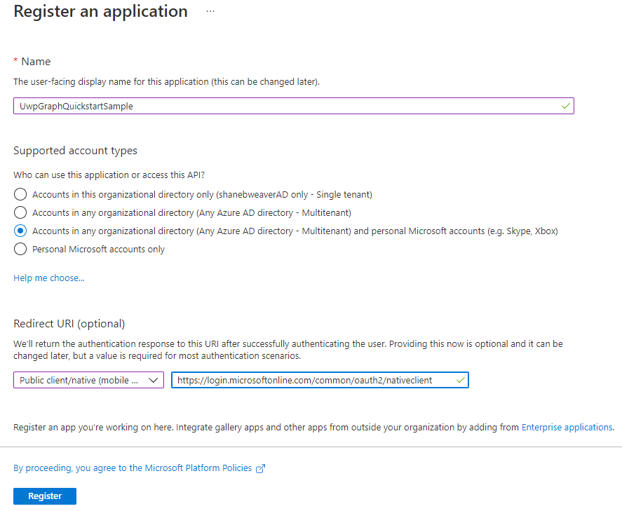

# Getting started with UWP and Microsoft Graph

Hello and welcome! In this getting-started guide you will learn how to add contextual user data and intelligence from the Microsoft Graph service into a modern UWP application.

## What is UWP

UWP is one of many ways to create client applications for Windows. UWP apps use WinRT APIs to provide powerful UI and advanced asynchronous features that are ideal for internet-connected devices.

To download the tools you need to start creating UWP apps, see [Get set up](https://docs.microsoft.com/en-us/windows/apps/windows-app-sdk/set-up-your-development-environment), and then [write your first app](https://docs.microsoft.com/en-us/windows/uwp/get-started/your-first-app).

The Microsoft development story continues to evolve, and along with initiatives such as [WinUI](https://docs.microsoft.com/en-us/windows/apps/winui/), [MSIX](https://docs.microsoft.com/en-us/windows/msix/overview), and [Windows App SDK](https://github.com/microsoft/WindowsAppSDK), UWP is a powerful tool for creating client apps.

For more details, visit [What's a Universal Windows Platform (UWP) app?](https://docs.microsoft.com/en-us/windows/uwp/get-started/universal-application-platform-guide)

## What is Microsoft Graph?

Microsoft Graph is the gateway to data and intelligence in Microsoft 365. It provides a unified programmability model that you can use to access the tremendous amount of data in Microsoft 365 and Windows 10/11. Use the wealth of data in Microsoft Graph to build consistent and contextual experiences that interact with millions of users.

For more details, visit [Overview of Microsoft Graph](https://docs.microsoft.com/en-us/graph/overview)

## Overview

In this guide we'll walk through:

1. Enabling user authentication by setting up an app registration in Azure.
1. Creating a new UWP project in Visual Studio (or bring your own).
1. Adding the Authentication and Graph nuget packages from the Windows Community Toolkit.
1. Setting up the global authentication provider.
1. Adding a Graph-powered control to enable login.
1. Making an ad-hoc call to a Microsoft Graph API.

By the end, you'll have a UWP application that enables a user to login and see their user display name from Microsoft Graph.

## What you'll need

To complete this guide you'll need the following:

- A device running Windows 10 or 11 OS
- An internet connection
- A personal Microsoft account

Now fire up Visual Studio and let's get started! 🚀

## 1. Create an app registration to enable user authentication

In order for authentication and login to work in your app, we must first create a relationship between your application and Microsoft identity services. This is a security step that prevents unknown applications from querying user data.

[Sign up for a free Microsoft Azure account](https://azure.microsoft.com/en-us/free/) and use Azure Active Directory to create an *app registration*.

Follow this walk-through to setup a new app registration in Azure Active Directory - [Quickstart: Register an application with the Microsoft identity platform](
https://docs.microsoft.com/en-us/azure/active-directory/develop/quickstart-register-app)



Give your app registration a name that can be displayed in an authorization prompt. This is so users know what app is requesting access to their Graph data when granting consent.

When selecting a sign in audience, consider using **Accounts in any organizational directory and personal Microsoft accounts**. This is the most flexible option that will work with public Microsoft accounts (Outlook, HotMail) as well as organizational accounts from work or school.

For **Redirect URI**, select the option **Public client/native (mobile & desktop)**, and input the value `https://login.microsoftonline.com/common/oauth2/nativeclient`.

When you've completed creating and configuring the app registration, record the **Client ID** value to use in the application later on.

## 2. Create a new UWP project or BYO

You'll need a UWP application as a baseline. If you already have a UWP project setup and ready to infuse with user insights from Microsoft Graph, please continue to the [next step](#add-nuget-packages-from-the-windows-community-toolkit).

To create a new UWP app, let's start by using the **Create a new project** option:

1. Find the project template, **Blank App (Universal Windows)**
2. Give your project a name and location, such as: `C:\Git\UwpGraphQuickstartSample`
3. Click the **Create** button to complete the wizard and create your new UWP application.


Visit [Create a "Hello, World!" app (XAML)](https://docs.microsoft.com/en-us/windows/uwp/get-started/create-a-hello-world-app-xaml-universal) for a more in-depth walk-through of how to create a new UWP project for the first time.

## 3. Add nuget packages from the Windows Community Toolkit

With your UWP project open in Visual Studio, find the **Project** menu item. Select **Manage NuGet Packages...**


Navigate to the **Browse** tab if you are not already there by default.

Use the search input field to lookup and install the latest versions of the following packages:

- `CommunityToolkit.Authentication.Msal`
- `CommunityToolkit.Graph.Uwp`


## 4. Setup a global authentication provider

To start making Graph API calls, we must first authenticate the user and get authorization to request their data from Microsoft Graph by [Initializing the GlobalProvider](https://docs.microsoft.com/en-us/windows/communitytoolkit/graph/authentication/overview#initializing-the-globalprovider).

Add this method to your app startup logic in `App.xaml.cs` to configure the global authentication provider.

Replace the `clientId` string `YOUR-CLIENT-ID-HERE` with the value retrieved in [step one](#create-an-app-registration-to-enable-user-authentication).

### App.xaml.cs

```
using CommunityToolkit.Authentication;
using Windows.ApplicationModel.Activation;
using Windows.UI.Xaml;
using Windows.UI.Xaml.Controls;

namespace UwpGraphQuickstartSample
{
    sealed partial class App : Application
    {
        public App()
        {
            InitializeComponent();

            ConfigureGlobalAuthProvider();
        }

        private void ConfigureGlobalAuthProvider()
        {
            if (ProviderManager.Instance.GlobalProvider == null)
            {
                var clientId = "YOUR-CLIENT-ID-HERE";
                var scopes = new string[] { "User.Read" };

                ProviderManager.Instance.GlobalProvider = new MsalProvider(clientId, scopes); ;
            }
        }

        protected override void OnLaunched(LaunchActivatedEventArgs e) { ... }
    }
}
```

## 5. Enable user login with the LoginButton control

To trigger the login flow for users, we will next add a [LoginButton control](https://docs.microsoft.com/en-us/windows/communitytoolkit/graph/controls/loginbutton). Open up the page where you want to put your login button, such as `MainPage.xaml`, and add a new `LoginButton` control as well as a `TextBlock`. A user can invoke the `LoginButton` to trigger sign in or out from their Microsoft account using the current global authentication provider. The button is also aware of the global provider state and will automatically update representation and function whenever the provider state changes. We'll use the `TextBlock` in the [next step](#make-an-ad-hoc-request-to-a-microsoft-graph-api).

### MainPage.xaml

```xml
<Page
    x:Class="UwpGraphQuickstartSample.MainPage"
    xmlns="http://schemas.microsoft.com/winfx/2006/xaml/presentation"
    xmlns:x="http://schemas.microsoft.com/winfx/2006/xaml"
    xmlns:d="http://schemas.microsoft.com/expression/blend/2008"
    xmlns:mc="http://schemas.openxmlformats.org/markup-compatibility/2006"
    xmlns:controls="using:CommunityToolkit.Graph.Uwp.Controls"
    mc:Ignorable="d"
    Background="{ThemeResource ApplicationPageBackgroundThemeBrush}">

    <StackPanel>
        <controls:LoginButton />
        <TextBlock x:Name="SignedInUserTextBlock" />
    </StackPanel>
</Page>
```

## 6. Make an ad-hoc request to a Microsoft Graph API

Now that our user can login, we can request access to data from Microsoft Graph APIs. Make sure to check the state of the current global authentication provider and see if a user is signed in before making Graph requests.
Otherwise any calls to Graph will not be authenticated and return a status code 401, **Forbidden**!

Add the following code to show/hide the current user's display name in response to changes in the global authentication state.

### MainPage.xaml.cs

```
using CommunityToolkit.Authentication;
using CommunityToolkit.Graph.Extensions;
using Windows.UI.Xaml.Controls;

namespace UwpGraphQuickstartSample
{
    public sealed partial class MainPage : Page
    {
        public MainPage()
        {
            this.InitializeComponent();

            ProviderManager.Instance.ProviderStateChanged += OnProviderStateChanged;
        }

        private async void OnProviderStateChanged(object sender, ProviderStateChangedEventArgs e)
        {
            if (e.NewState == ProviderState.SignedIn)
            {
                SignedInUserTextBlock.Text = "Signed in as...";

                var graphClient = ProviderManager.Instance.GlobalProvider.GetClient();
                var me = await graphClient.Me.Request().GetAsync();

                SignedInUserTextBlock.Text = "Signed in as: " + me.DisplayName;
            }
            else
            {
                SignedInUserTextBlock.Text = "Please sign in.";
            }
        }
    }
}
```

## Running the application

Press F5 to launch the application and use the login button to choose a local account to sign in with. Once signed in, observe the user's display name is displayed in the text block. That's it!

Hopefully this simple guide will help you hit the ground running with calling Graph APIs in your UWP applications. We can't wait to see what you build with them 🚀


